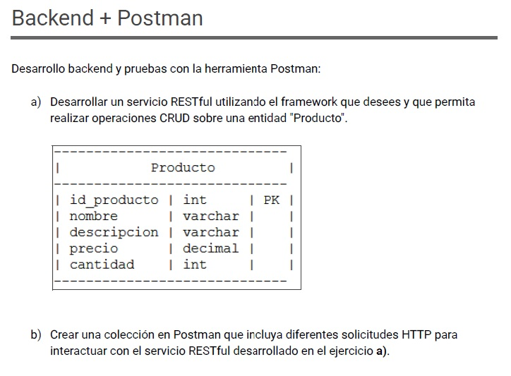
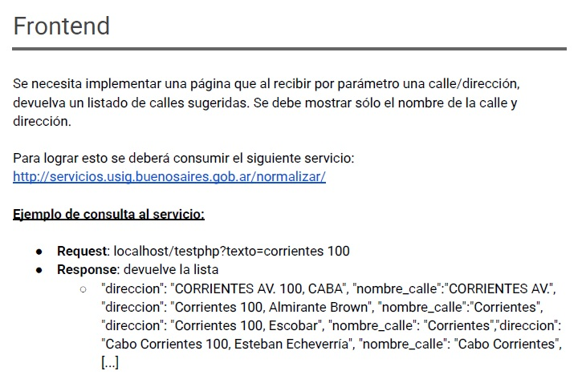
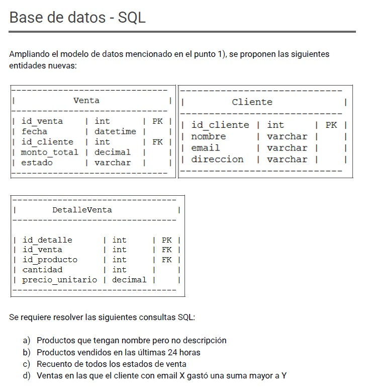
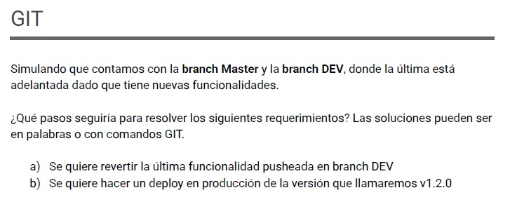

# Examen Técnico

Este repositorio contiene la solución al examen técnico, incluyendo el backend, frontend y documentación.

## Consignas

### Backend

### Frontend

### Base de Datos SQL

### Git

---

## Instalación y ejecución

Consulta los archivos [backend/README.md](backend/README.md) y [frontend/README.md](frontend/README.md) para instrucciones detalladas de instalación y uso.
